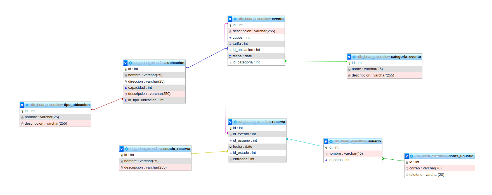

# EventFlow

## Objetivo:
EventFlow es un sistema de gestión de reserva de eventos en donde se podrán almacenar los mismos con sus respectivos datos (capacidad, tarifa, ubicación, categoría...). Los usuarios podrán hacer reservas y se podrá acceder a la información respectiva desde cualquiera de las entidades.

## Estructura del backend
La estructura del backend que voy a entregar será las tablas de usuario, evento y reserva con sus respectivas relaciones y enrutado para acceder a la información desde cualquiera de estas 3 entidades.

# Esquema de la base de datos:

